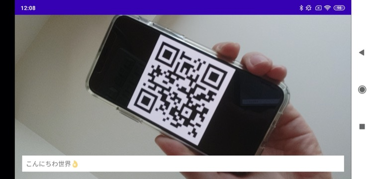

# Android QR code reader sample with CameraX and ML Kit

Android sample app of QR Code reader with [CameraX](https://developer.android.com/training/camerax) 1.0.0-beta4 and [Firebase ML Kit](https://firebase.google.com/docs/ml-kit) 24.0.3.

